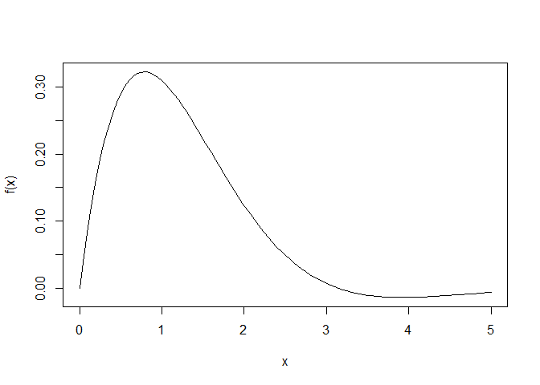
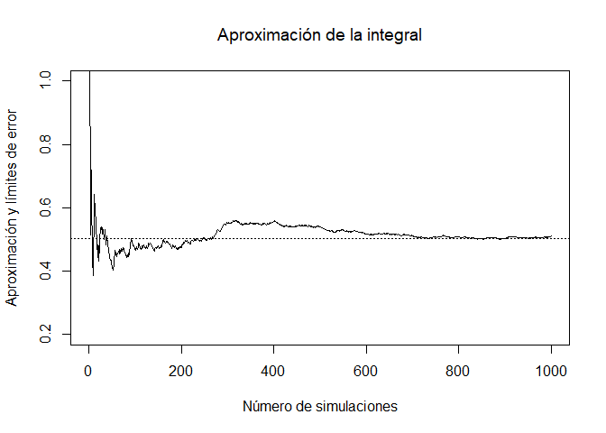
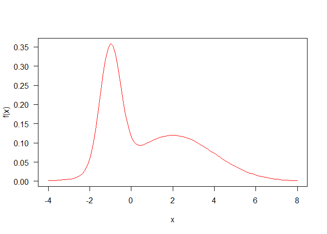
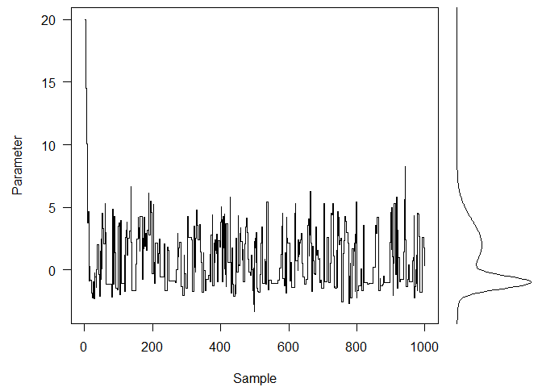
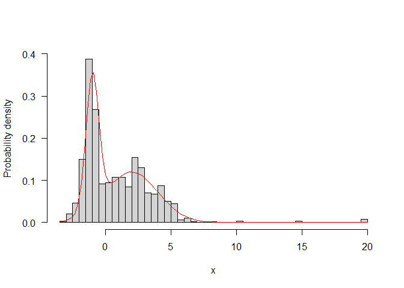
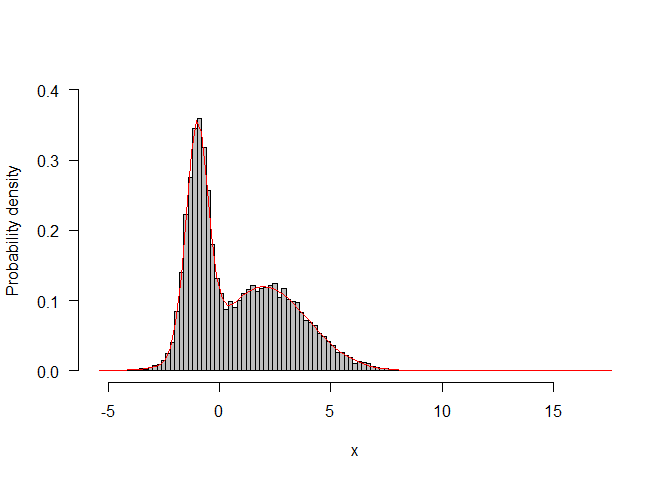

-   <a href="#introducción" id="toc-introducción">Introducción</a>
    -   <a href="#introducción-a-métodos-de-monte-carlo"
        id="toc-introducción-a-métodos-de-monte-carlo">Introducción a métodos de
        Monte Carlo</a>
-   <a href="#cadenas-de-markov-en-métodos-de-monte-carlo"
    id="toc-cadenas-de-markov-en-métodos-de-monte-carlo">Cadenas de Markov
    en métodos de Monte Carlo</a>
    -   <a href="#idea" id="toc-idea">Idea</a>
    -   <a href="#metropolis-hastings"
        id="toc-metropolis-hastings">Metropolis-Hastings</a>
        -   <a href="#desarrollo-formal-de-la-idea"
            id="toc-desarrollo-formal-de-la-idea">Desarrollo formal de la Idea</a>
        -   <a href="#un-ejemplo" id="toc-un-ejemplo">Un ejemplo</a>
-   <a href="#referencias" id="toc-referencias">Referencias</a>

# Introducción

Vamos a ver qué son los Métodos de Monte Carlo basados en cadenas de
Markov. Las siglas vienen del inglés, *Markov Chain Monte Carlo*. Para
ello, me baso en el tutorial mencionado en las referencias.

En realidad, van a ser procesos de Markov de acuerdo a las definiciones
dadas en clase, (vamos a ver Procesos de Markov con espacio de estados
continuo ℝ y tiempo discreto ℕ) sin embargo seguiremos llamándolo
cadenas de Markov porque aparentemente es la nomenclatura.

Además, usamos resultados vistos para cadenas de Markov (espacio de
estados numerable) para procesos de Markov, lo cual no vamos a
justificar, pero para lo cual hay referencias online[1].

## Introducción a métodos de Monte Carlo

Los métodos de Monte Carlo en general pretenden utilizar muestreo
aleatorio repetidamente para obtener algún tipo de resultado numérico.

Por ejemplo, aquí incluyo unos scripts de R para aproximar el valor de
la siguiente integral.

∫05sin (*x*)*e*−*x**d**x*

    set.seed(1)
    f <- function(x) sin(x) * exp(-x)
    curve(f, 0, 5)

Para ello lo que hacemos es tomar un número de muestras de una variable
*U*(0,5) del espacio y evaluamos *f* en esos puntos.

    numero_simulaciones <- 1000
    x <- runif(numero_simulaciones, min = 0, max = 5)
    fx <- f(x)

Entonces el valor aproximado de la integral es

    integral_aprox <- (5 - 0) * mean(fx)
    integral_aprox

    ## [1] 0.5105885

Que intuitivamente puedes llegar a reducirlo, a base por altura media.
El valor aproximado por un método numérico clásico sería

    ## [1] 0.5022749

Además podemos ver cómo evoluciona la aproximación de acuerdo al número
de muestras aleatorias tomadas:

 Aquí además
hemos indicado en horizontal el valor de la integral calculada
numéricamente.

Monte Carlo también se puede utilizar para aproximar la probabilidad de
un suceso o, como es más utilizado, para aproximar distribuciones de
probabilidad cuya expresión analítica

# Cadenas de Markov en métodos de Monte Carlo

Aquí vamos a abordar el caso de que queramos tomar muestras de una
distribución determinada, con motivos de simulación, por ejemplo.

## Idea

Lo que vamos a hacer es crear una cadena (de nuevo, en realidad proceso)
de Markov que tenga como distribución límite la distribución deseada,
para lo cual debemos exigir que cumpla las condiciones del teorema
ergódico, de forma que la distribución límite sea la estacionaria.

Así, vamos a buscar una cadena de Markov irreducible, aperiódica en la
cual todos los estados sean recurrentes positivos.

Claro está, esto sólo lo hemos visto para cadenas de Markov (espacio de
estados numerable), pero hay resultados similares en el caso no
numerable. También podemos considerar una cadena de Markov con un número
de nodos suficientemente grande, tal que el programa que vamos a ver en
R sea una buena aproximación al modelo matemático.

Entonces, dada esta cadena, vamos a caminar por ella, y el estado
resultante de cada paso es una muestra de la distribución deseada. Esto
viene de atender al hecho de que esta cadena tiene como distribución
límite la distribución de probabilidad deseada.

## Metropolis-Hastings

Sea *f* una función proporcional a la función de densidad *p* que
deseamos aproximar, con lo cual
$$
    \frac{f(x')}{f(x\_i)} = \frac{p(x')}{p(x\_i)}
$$

Sea *Q*(*x*|*y*) una distribución de probabilidad simétrica que usaremos
para generar un nuevo candidato dado el punto actual *y*. Típicamente se
elige la distribución normal (en el número de dimensiones adecuado).
Esto es una [caminata aleatoria
gaussiana](https://en.wikipedia.org/wiki/Random_walk#Gaussian_random_walk)

Se toma un estado *x**i* arbitrario.

Entonces el método consiste en:

1.  Se propone un nuevo estado *x*′ a partir de *x**i* con
    *Q*
2.  Se calcula la probabilidad de aceptación del candidato
    *α* = *m**i**n*{1, *f*(*x*′)/*f*(*x**i*)}
3.  Aceptar la nueva posición con probabilidad *α* (tomando una muestra
    de *U*(0, 1)).
4.  El siguiente estado *x**i* + 1 es o bien el nuevo,
    aceptado, o nos mantenemos en el previo, *x**i*, si fue
    rechazado.

Se obtiene así una sucesión {*x**n*}*n* ∈ ℕ de
muestras dependientes. Esta dependencia perderá relevancia para un
número suficiente de pasos.

### Desarrollo formal de la Idea

Si esta sección la completo, posiblemente lo haga dentro de un tiempo.
De momento, la sección de [derivación formal del artículo de Metropolis
Hastings](https://en.wikipedia.org/wiki/Metropolis%E2%80%93Hastings_algorithm#Formal_derivation)
está bastante completo.

### Un ejemplo

Tomaremos *X* una variable aleatoria una mixtura[2] de dos
distribuciones normales. Este tipo de distribución puede resultar de
tomar muestras de una mezcla heterogénea respecto a alguna
característica.

Tomaremos una mixtura de dos normales, una 𝒩(−1,0.5) y una 𝒩(2,2), con
pesos 0.4 y 0.6 = 1 − 0.4, respectivamente.

    p <- 0.4
    medias <- c(-1, 2)
    desv_tipicas <- c(.5, 2)
    f <- function(x) {
        p * dnorm(x, medias[1], desv_tipicas[1]) +
            (1 - p) * dnorm(x, medias[2], desv_tipicas[2])
    }
    curve(f(x), col = "red", -4, 8, las = 1)

Entonces unas funciones para implementar el método:

La *Q* que generará estados a partir del actual. El valor de la
desviación típica 4 ha sido elegido arbitrariamente.

    q <- function(x) rnorm(n = 1, mean = x, sd = 4)

Esta función da un paso del método anteriormente descrito:

    paso <- function(punto_previo, f, q) {
        ## Nuevo posible punto:
        candidato <- q(punto_previo)
        ## Probabilidad de aceptar el nuevo punto:
        alpha <- min(1, f(candidato) / f(punto_previo))
        ## Aceptarlo con probabilidad alpha
        if (runif(1) < alpha) {
            candidato
        } else { # de lo contrario, quedarse quieto
            punto_previo
        }
    }

Y esta función ejecutará el método el número de pasos indicado

    método <- function(x, f, q, npasos) {
        res <- matrix(NA, npasos, length(x))
        for (i in seq_len(npasos)) {
            res[i, ] <- x <- paso(x, f, q)
        }
        drop(res)
    }

Nota: aquí, `método` está implementado de esta extraña manera porque
permitirá generalizar a el caso multidimensional, los cuales son los
interesantes.

Empezando en un punto arbitrario, por ejemplo, 20, y ejecutando 1000
pasos:

    res <- método(20, f, q, 1000)

Para *n* = 50000:

Aquí incluyo el código para representar las tres últimas gráficas.

Gráfica 1:

    layout(matrix(c(1, 2), 1, 2), widths = c(4, 1))
    par(mar = c(4.1, .5, .5, .5), oma = c(0, 4.1, 0, 0))
    plot(res, type = "s", xpd = NA, ylab = "Parameter", xlab = "Sample", las = 1)
    usr <- par("usr")
    xx <- seq(usr[3], usr[4], length = 301)
    plot(f(xx), xx, type = "l", yaxs = "i", axes = FALSE, xlab = "")

Gráfica 2:

    hist(res, 50,
        freq = FALSE, main = "", ylim = c(0, .4), las = 1,
        xlab = "x", ylab = "Probability density"
    )
    z <- integrate(f, -Inf, Inf)$value
    dist_real <- function(x) f(x) / z
    curve(dist_real(x), add = TRUE, col = "red")

Gráfica 3:

    set.seed(1)
    res.largo <- método(20, f, q, 50000)
    hist(res.largo, 100,
        freq = FALSE, main = "", ylim = c(0, .4), las = 1,
        xlab = "x", ylab = "Probability density", col = "grey"
    )
    curve(dist_real(x), add = TRUE, col = "red")

# Referencias

-   Un tutorial en el cual me baso de manera importante:
    -   <https://nicercode.github.io/guides/mcmc/>
-   Wikipedia:
    -   <https://en.wikipedia.org/wiki/Markov_chain_Monte_Carlo>
    -   <https://en.wikipedia.org/wiki/Metropolis%E2%80%93Hastings_algorithm>
    -   <https://en.wikipedia.org/wiki/Markov_chains_on_a_measurable_state_space>
    -   <https://en.wikipedia.org/wiki/Harris_chain>
-   Bookdown.org
    -   <https://bookdown.org/content/3686/markov-chain-monte-carlo.html>

[1] Véase este [artículo sobre lo que llaman cadenas de
Harris](https://en.wikipedia.org/wiki/Harris_chain). Trata procesos de
Markov con espacio de estados no numerables pero medibles.

[2] Una mixtura de una familia de variables aleatorias
{*X**i*}*i* ∈ *Γ* es una variable aleatoria cuya
distribución es una combinación convexa de las funciones de distribución
de las {*X**i*}*i* ∈ *Γ*. Nosotros nos limitaremos
a mixturas finitas, y de hecho veremos sólo la mixtura de dos variables
aleatorias. Véase más en [el artículo de
Wikipedia](https://en.wikipedia.org/wiki/Mixture_distribution).
